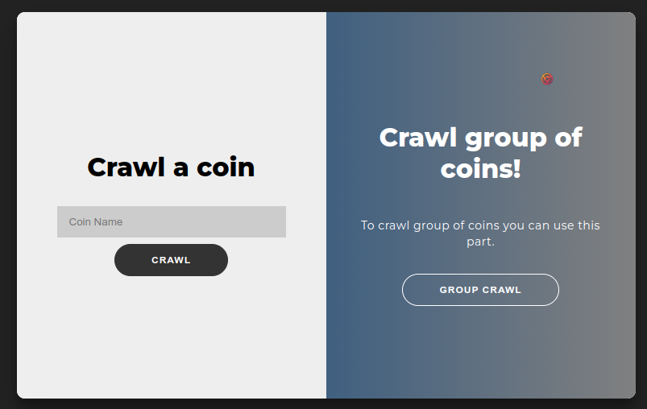
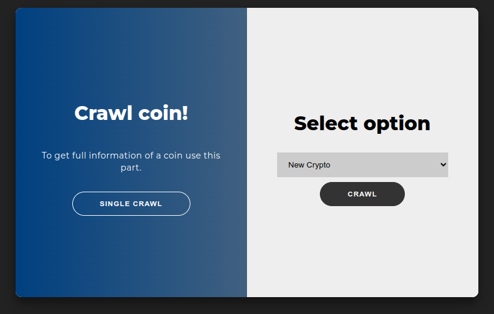
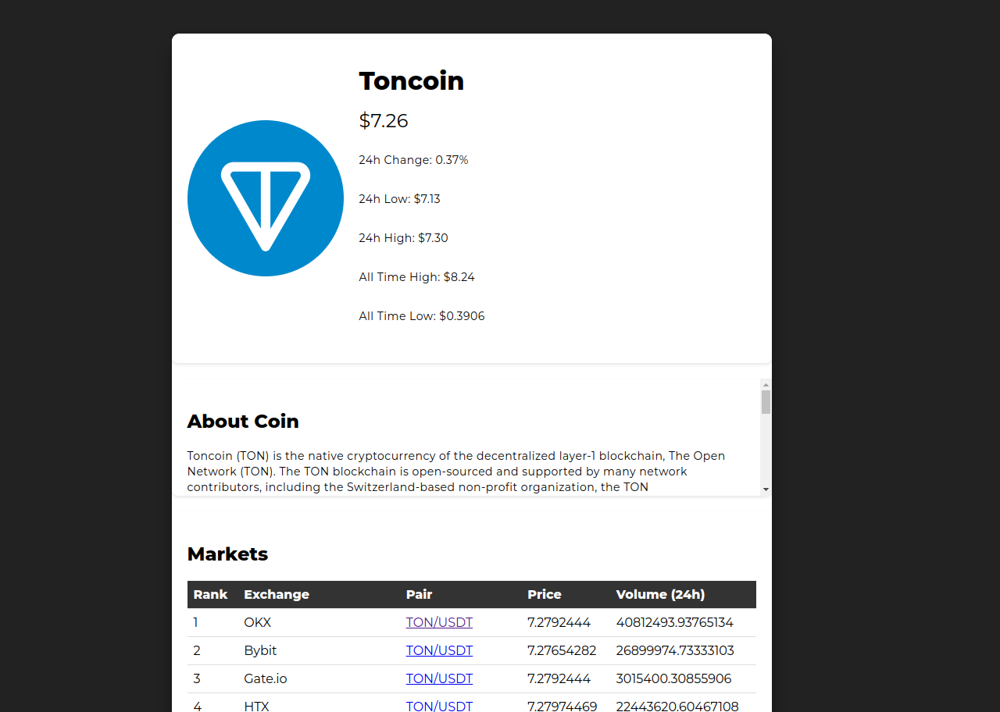
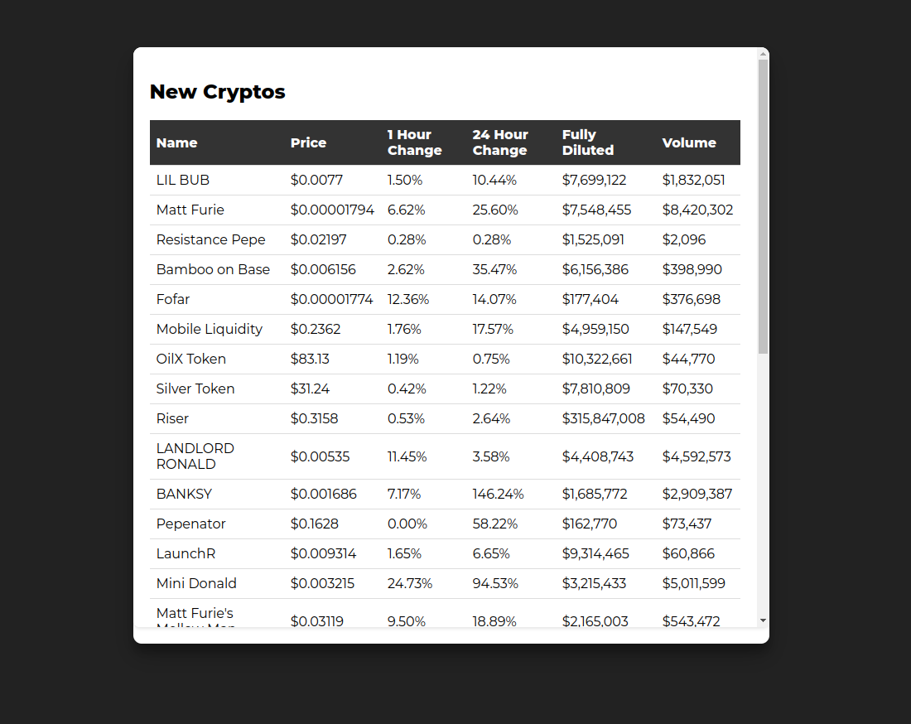

# Coin Crawler Project

Welcome to the Coin Crawler Project! This project is designed to crawl and scrape data about various cryptocurrencies from CoinMarketCap using the Scrapy framework and a Flask web service.

## Overview

This project consists of three main components:

- **coin_crawler_app.py**: This is the web service component that allows users to select and retrieve cryptocurrency data via a web interface.
- **coin_crawler_all_coins.py**: This script is responsible for crawling and scraping data for all cryptocurrencies based on different categories.
- **coin_crawler_single_coin.py**: This script is used to crawl and scrape data for a specific cryptocurrency.

## Libraries Used

The following libraries are used in this project:

- **[Flask](https://flask.palletsprojects.com/)**: Used for creating the web service and rendering templates.
- **[Scrapy](https://scrapy.org/)**: Used for web crawling and data scraping.
- **[Scrapy-Splash](https://github.com/scrapy-plugins/scrapy-splash)**: Used for handling JavaScript-rendered pages in Scrapy.
- **[requests](https://docs.python-requests.org/)**: Used for making HTTP requests.
- **[json](https://docs.python.org/3/library/json.html)**: Used for handling JSON data.
- **[os](https://docs.python.org/3/library/os.html)**: Used for interacting with the operating system.
- **[sys](https://docs.python.org/3/library/sys.html)**: Used for accessing system-specific parameters and functions.
- **[time](https://docs.python.org/3/library/time.html)**: Used for time-related functions.

## Detailed Explanation

### coin_crawler_app.py
This is the web service side of the project, allowing users to interact with the cryptocurrency crawler through a web interface. The key components of the script are:

- **FlaskLibrary Class**: This class manages the web application. The main methods include:
  - `get_crypto_name()`: Handles user requests, retrieves the selected option, and triggers the appropriate crawler script based on user input. It then renders the scraped data in the corresponding HTML template.
  - `run()`: Starts the Flask web service.

### coin_crawler_all_coins.py
This script crawls and scrapes data for all cryptocurrencies under different categories such as "new crypto," "most viewed crypto," etc. The key components of the script are:

- **CryptoInfo Class**: This is the main Scrapy spider that handles the crawling process. The key methods include:
  - `__init__()`: Initializes the spider with the category to crawl.
  - `get_start_urls()`: Returns the starting URLs based on the category.
  - `start_requests()`: Sends requests to the starting URLs with appropriate headers.
  - `parse()`: Parses the response based on the category and saves the scraped data to a JSON file.

### coin_crawler_single_coin.py
This script is used to crawl and scrape data for a specific cryptocurrency. The key components of the script are:

- **CryptoInfo Class**: Similar to the `coin_crawler_all_coins.py` script but focused on a single cryptocurrency. The key methods include:
  - `__init__()`: Initializes the spider with the cryptocurrency name.
  - `start_requests()`: Sends requests to the URL of the specified cryptocurrency.
  - `parse()`: Parses the response to extract relevant data such as price, 24-hour change, all-time high/low, and more.

## How It Works

### Web Service:
- The `coin_crawler_app.py` script starts a Flask web service that allows users to select a category or enter a specific cryptocurrency name.
- Based on the user's selection, the appropriate crawler script (`coin_crawler_all_coins.py` or `coin_crawler_single_coin.py`) is executed.
- The results are displayed on a web page.

### Data Crawling:
- The crawler scripts (`coin_crawler_all_coins.py` and `coin_crawler_single_coin.py`) send requests to CoinMarketCap, scrape the data, and save it as a JSON file.

## Installation and Setup

To use this project, follow these steps:

1. Clone the repository:
    ```bash
    git clone https://github.com/amiriiw/coin_crawler
    cd coin_crawler
    ```

2. Install the required libraries:
    ```bash
    pip install Flask Scrapy scrapy-splash requests
    ```

3. Start the web service:
    ```bash
    python coin_crawler_app.py
    ```

4. Open your web browser and go to `http://localhost:5000` to interact with the coin crawler.

## Sample Images

Here are some sample images from the project:

<p align="center">
  
  
</p>
<p align="center">
  
  
</p>


## License

This project is licensed under the MIT License. See the [LICENSE](LICENSE) file for details.
